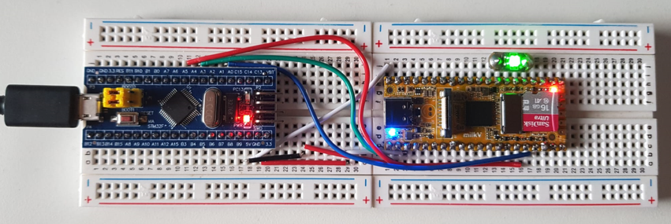
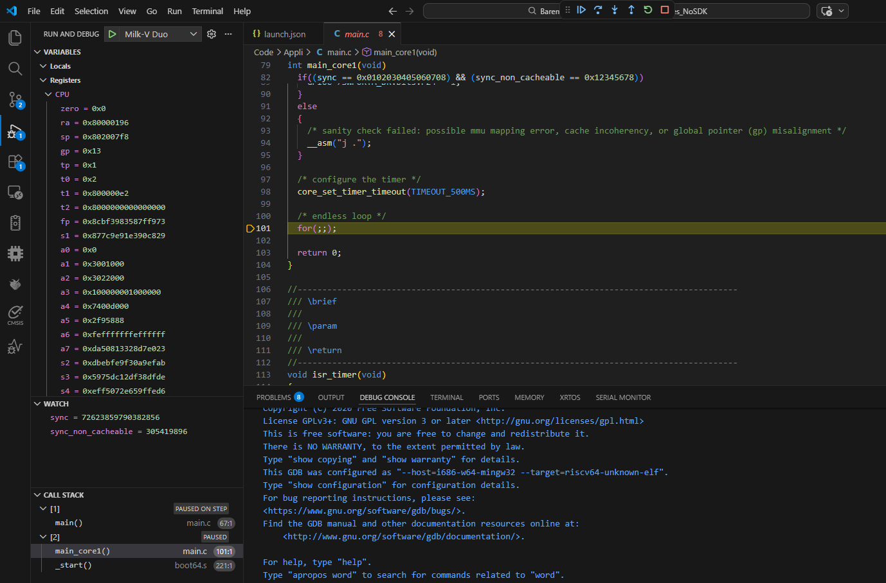

Bare Metal Milk-V Duo Project
============================

[](https://github.com/Chalandi/Baremetal_Milk-V_Duo_Dual_RV64_Cores_NoSDK/actions)

This repository features a bare-metal project for the Milk-V Duo (dual-core C906 RISC-V 64-bit SoC), built entirely from scratch without the use of the vendor's SDK.


Key Features:

* Dual-core C906 Support: Leverages both RISC-V 64-bit cores.
* T-Head Extension Support: Enables custom ISA instructions specific to the C906 core.
* Static MMU Configuration: Pre-defined flat memory mapping for predictable execution.
* Cache Management: Full control over Instruction (I-Cache) and Data (D-Cache).
* Supervisor Mode (S-mode): Runs with interrupts enabled for advanced system handling.
* Early JTAG Access: Configures JTAG pinmuxing during the boot-up phase for easier debugging.
* Robust Build System: A clear, production-grade implementation in C11 and Assembly, paired with a GNU Make workflow.

Whether you are looking for a starting point for your own OS or simply want to understand the Milk-V Duo hardware from the ground up, this project provides a clear and educational framework.


## Details on the Application

Both C906 cores boot from the same entry point (`0x80000000`) in DDR. The application implements a coordinated SMP boot flow.

The low-level startup process begins on C906 Core 0, which performs the following:

- Initializes the MMU and Caches.
- Sets up the Interrupt Vector.
- Transitions the execution mode to S-mode.
- Initializes the C/C++ runtime environment (CRT).

During this initial phase, C906 Core 1 is held in a reset state. Once the primary core has stabilized the system and initialized shared resources, Core 1 is released to begin its own initialization sequence.

Because the two cores are physically located on different CPU clusters, the chip designers assigned `mhartid` a value of `0` for both cores. Consequently, the boot process cannot rely on the standard Hart ID for differentiation. Instead, the bootstrap identifies the CPUs based on the `misa` register to determine which core is currently executing.

Each core executes its own dedicated main function. Core 0 begins by configuring a system timer with a 500ms timeout. Meanwhile, Core 1 starts with a lightweight sanity check to verify MMU and cache consistency. This check validates two 64-bit variables previously initialized by the Core 0 C-runtime environment, allowing the system to detect any memory incoherence between the two clusters. After this verification is successful, Core 1 also configures its own system timer for a 500ms timeout. Once the initialization is complete, both cores generate S-mode timer interrupts used to toggle GPIO pins, creating a visual heartbeat for each core.

## Building the project

To build the project, you need an installed RISC-V GCC compiler with T-Head extension support (riscv64-unknown-elf) you can download it from link below in Tools section.

Create an environment variable named `TOOLCHAIN_GCC_T_HEAD` pointing to the compiler's root directory (e.g., `C:/Compilers/Xuantie-900-gcc...`).

Run the following commands :

```sh
cd ./Build
Rebuild.sh
```

The build process generates the following artifacts in the `Output` directory :

  - ELF file
  - HEX mask
  - Assembly listing
  - MAP file
  - Binary file ( `fip.bin`)

## Running the application on Milk-V Duo board

To run the application, copy the `fip.bin` binary file to the root of a bootable SD card and power on the board.

## CKLink debugger for C906 core

A Blue Pill board flashed with CK-Link firmware (`Debug/cklink_lite_mod.hex`) can be used as a JTAG interface to debug the C906 cores on the Milk-V board.



| BluePill (CK-Link) | Milk-V Duo   | Function |
| ------------------ | ------------ | -------- |
| PB9                | GP0 (pin1)   | JTAG_TDI |
| PA4                | GP1 (pin2)   | JTAG_TDO |
| PA5                | GP12 (pin16) | JTAG_TMS |
| PA1                | GP13 (pin17) | JTAG_TCK |

## Debugging the application using VS Code

To debug the application open the root folder with 'VS Code' and click on debug, Both cores can be monitored and debugged simultaneously.



## Tools

The following tools are needed to build and debug this project:

| Tool                          | Link                                                         |
| ----------------------------- | ------------------------------------------------------------ |
| XuanTie-compiler (Windows)    | https://occ-oss-prod.oss-cn-hangzhou.aliyuncs.com/resource//1695015955142/Xuantie-900-gcc-elf-newlib-mingw-V2.6.1-20220906.tar.gz |
| XuanTie-compiler (Linux)      | https://occ-oss-prod.oss-cn-hangzhou.aliyuncs.com/resource//1695016121707/Xuantie-900-gcc-elf-newlib-i386-V2.6.1-20220906.tar.gz |
| XuanTie-DebugServer (Windows) | https://occ-oss-prod.oss-cn-hangzhou.aliyuncs.com/resource//1749727559795/XuanTie-DebugServer-windows-V5.18.5-20250612-1519.zip |
| XuanTie-DebugServer (Linux)   | https://occ-oss-prod.oss-cn-hangzhou.aliyuncs.com/resource//1749727598705/XuanTie-DebugServer-linux-i386-V5.18.5-20250612.sh.tar.gz |

## Continuous Integration

CI runs on pushes and pull-requests with a simple build and result verification on `ubuntu-latest` using GitHub Actions.
